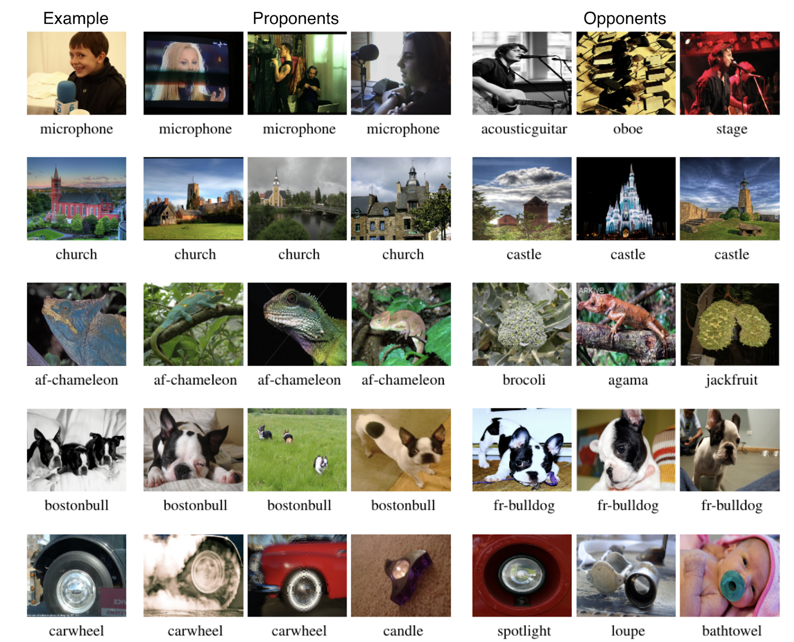
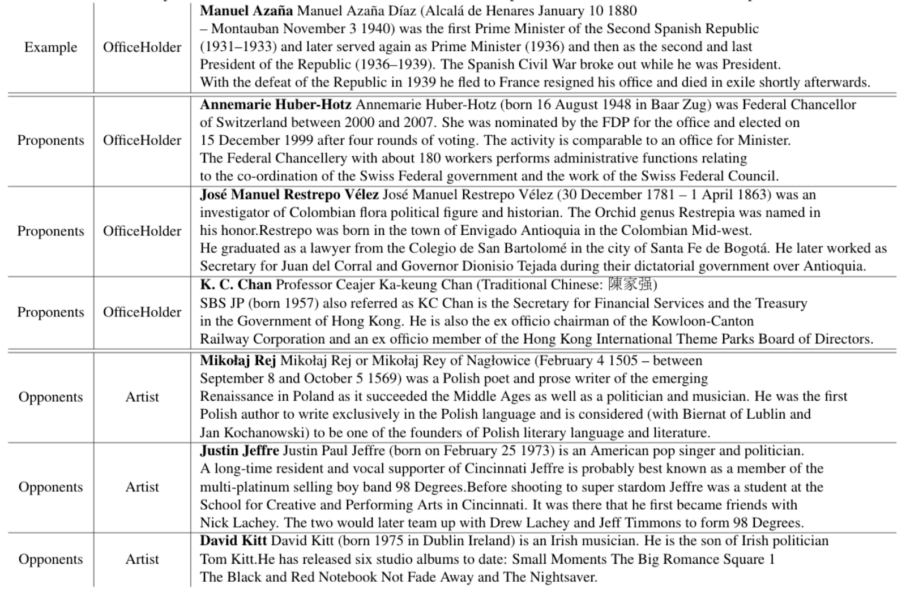

# TrackIn
[Implementation of Estimating Training Data Influence by Tracking Gradient Descent](https://arxiv.org/pdf/2002.08484.pdf)

## Broader Impact
This wrok proposes a practical technique to understand the influence of training data points on loss functions/predictions/differentiable metrics. The technique is easier to apply than previously proposed techniques, and we hope it is widely used to understand the quality and influence of training data. For most real world applications, the impact of improving the quality of training data is simply to improve the quality of the model. In this sense, we expect the broader impact to be positive.

Most of the implementation in this repo will be in the form of colabs. 

## Goal
Identify the influence of a training data point on the output of specific function of a test data point.
The output of the loss function is selected to calculate influence for the following equation.

## Terminology
* **Proponents** have positive scores proportional to loss reduction.
* **Opponents** have negative scores proportional to loss enlargement.
* **Self-influence** is the influence of a training point on its own loss.

## Results from paper
### Image Classification (Imagenet)

### Text Classification (DBPedia)

