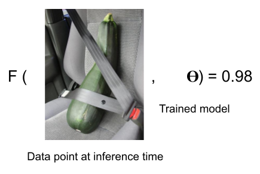
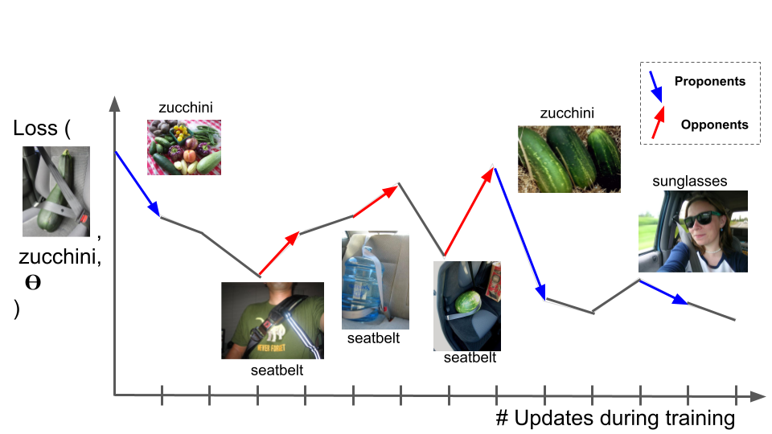
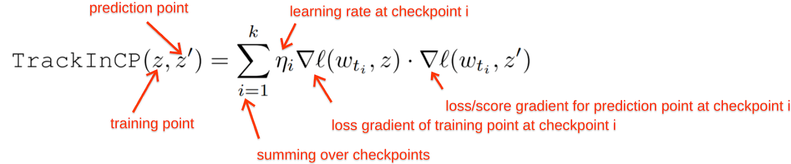

# TracIn
[Implementation of Estimating Training Data Influence by Tracing Gradient Descent](https://arxiv.org/pdf/2002.08484.pdf)

## Goal: Identify the influence of training data points on F(data point at inference time).

## Idea: Trace Stochastic Gradient Descent (Using the loss function as F)

## Equation 

## Broader Impact
This work proposes a practical technique to understand the influence of training data points on loss functions/predictions/differentiable metrics. The technique is easier to apply than previously proposed techniques, and we hope it is widely used to understand the quality and influence of training data. For most real world applications, the impact of improving the quality of training data is simply to improve the quality of the model. In this sense, we expect the broader impact to be positive.

Most of the implementation in this repo will be in the form of colabs. Consider reading the [FAQ](https://drive.google.com/file/d/1zL3hwW4wFru49_-zwpmliRDdCahjumXa/view) before adapting to your own data.

## Terminology
* **Proponents** have positive scores proportional to loss reduction.
* **Opponents** have negative scores proportional to loss enlargement.
* **Self-influence** is the influence of a training point on its own loss.
